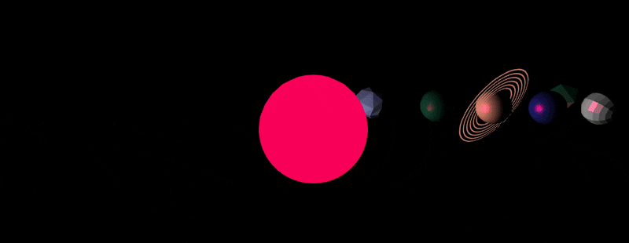
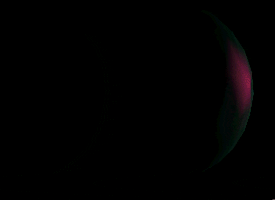
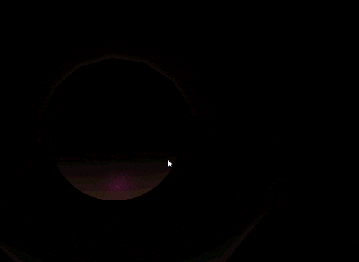
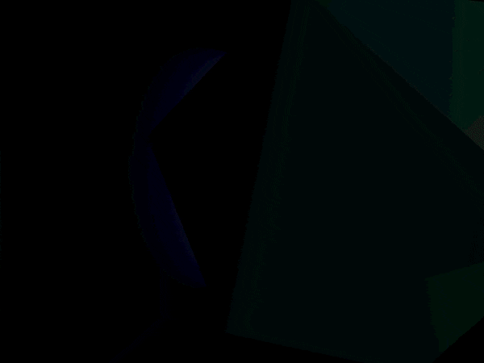
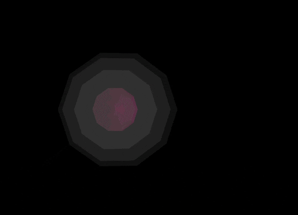

# Assignment #2

## Due: November 4, 2018 at 11:59pm

Up to 50 points of credit plus 15 points extra credit. There is no partial credit on any individual requirement.

### Repository setup:

1. By now you have followed the link to create your assignment repository at https://classroom.github.com/a/rqePP3be. Please use this link once as it will create an repository we will not check for submissions if you use it multiple times. The repository name should lool like **a2-githubusername**. Any others will get removed.

2. You should also be sure to share your GitHub username with us via this link if you have not already. https://goo.gl/forms/AKQYcllzjOP4UV6f1

   * You should also be sure to setup your local git environment and ssh keys to work with GitHub.

3. Once your repository is created you will have a copy of the assignment template in your github repository. Now you can clone the repository onto your local computer using the following command. Be sure do execute this command from the directory you wish to locate your work.

```bash
$ git clone git@github.com:ucla-fa18-cs174a/a2-githubusername.git
```

4. You can now follow the remaining steps of the assignment.

### Gettting Started:

When you open your project, you will see a blank `Assignment_Two_Scene` that draws a single Torus shape (donut).  Replace this scene with the solar system we specify in detail below.

Items in your code for you to fill in are marked `TODO`.  You shouldn't need to edit outside of there, or any file besides `main-scene.js`.

1.  Fill in the constructor of `Assignment_Two_Scene` to instantiate the shapes and materials that you will need, as follows.

Use our provided initial camera matrix that looks diagonally down at the scene, far back enough to see it.

Instantiate four spheres with each of 1, 2, 3, and 4 for the number of subdivisions.  You may take advantage of previously given code for spheres.

For the sphere instances that have 1 or 2 subdivisions, use flat shading to build them.  If you don't want to re-invent the sphere algorithm to make a flat-shaded version, you may use the `make_flat_shaded_version()` function built into our `Shapes`.  To call it on a shape with class name N, wherever N appears simply replace it with the code ( `N.prototype.make_flat_shaded_version()` ) including the outer parenthesis.

2.  Draw the following scene in the `display()` function of `Assignment_Two_Scene`.



(a) Place a spherical sun at the origin.  Use a sphere that is subdivided 4 times.  Use maximum ambient in the material.  It swells from radius 1 up to 3 over a 5 second period, and fades from blue when it's smallest to red when it's biggest. **- 5 points.**

(b) Make a point light source located in the center of the sun, matching the current color of the sun ball, with a size parameter equal to 10**n where n is the current sun radius.  In JavaScript, ** is the exponent operator.  Since the light's size is changing and not the brightness, you should see the outer planets darken more than the inner ones whenever the sun shrinks. **- 7 points.**

(c) Place four orbiting planets.  Their radii shall all be 1.  The smallest orbit shall be 5 units away from the sun and each orbit after shall be 3 units farther, with each farther planet revolving at a slightly slower rate.  Leave the ambient lighting of each planet the default value of zero. **- 5 points.**

Planet descriptions, from the inside out:

Planet 1:  Icy-gray, 2 subdivisions, flat shaded, diffuse only. **- 5 points.**


Planet 2:  Swampy green-blue, 3 subidivisons, maximum specular, low diffuse.  Apply Gouraud shading to it every odd second, but regular smooth shading every even second. **- 8 points.**

To Gouraud shade:  Find the code in Phong_Shader that calculates the Phong formula.  It's in a GLSL function called phong_model_lights().  Observe how either the vertex shader or fragment shader programs have the ability to call phong_model_lights() to compute the Phong color.  To perform Gouraud shading, make sure the Phong calculation occurs in the vertex shader.  Inside your material object, assigning gouraud:1 will tell it to perform the Phong calculation early enough for that.  Otherwise, to perform smooth shading, leave this flag unset so that the process waits to call phong_model_lights() until the fragment shader.  Remember that with Gouraud shading, the fragment shader interpolates colors; with smooth shading, the fragment shader interpolates normals.



Planet 3:  Muddy brown-orange, 4 subdivisions, maximum diffuse and specular.  The planet must wobble on in its rotation over time (have an axis not the same as the orbit axis).  The planet must have a ring.  You can use the provided torus shape, scaled flatter (reduced z axis scale).  The ring and planet must wobble together - so base the ring's matrix directly on the planet's matrix.  Give the ring the same material as the planet, unless you make a custom shader for it for extra credit, as described below. **- 5 points.**



Planet 4:  Soft light blue, 4 subdivisions, smooth phong, high specular.  Add a moon for this planet.  The moon has 1 subdivision, with flat shading, any material, and a small orbital distance around the planet. **- 5 points.**



(d) Camera buttons: (10 points) To help us grade, we have implemented some buttons.  They are visible on your program, but they do not work at first.  These buttons are intended to attach the camera to each planet, one at a time, fixed upon the front of the planet for closer viewing.

In order for these buttons to start working, your display() function must assign new values to your camera matrix.  Your display() function must also fill in the following class-scope variables with the correct planet's model matrix: "this.planet_1" "this.planet_2" "this.planet_3" "this.planet_4" "this.moon" and (extra credit) "planet5".

Once you have those, the buttons will now set the function this.attached() to return the matrix of the planet we want.  This is like storing a pointer to the planet's matrix that will always be up-to-date with new values of it.  In JavaScript when we want a long-term pointer to a variable we often use a function returning a variable (a "closure") instead.

Now you must call this.attached() to assign to the camera matrix.  Only do the following when the value of this.attached is not undefined (so, when a button has already been pressed).  Somewhere in display, compute the desired camera matrix (let's call that "desired") by calling this.attached(), translating the returned value by 5 units to back away from the planet (we don't want to be inside of it), and then inverting that matrix (because it's going to be used for a camera, not a shape).  Assign that resulting value of desired into the variable graphics_state.camera_transform.


#### Extra Credit Part I

Instead of directly assigning desired to `graphics_state.camera_transform`, blend it with the existing camera matrix (from the previous frame) so that we smoothly pull the camera towards equaling desired instead of immediately getting there.  To mix two matrices, you can use `desired.map( (x,i) => Vec.from( graphics_state.camera_transform[i] ).mix( x, blending_factor ) )` where .1 would make a good blending factor. **- 2 points.**

At a blending speed of .1, you will still have some leeway to control the camera while attached (especially mouse steering), although it will tend to pull you back to viewing the selected planet.  As you press the buttons, see if you can notice any undesired effects of blending matrices this way to generate intermediate camera matrices -- a subtle problem can be seen because our code snippet above uses linear blending instead of quaternions.

#### Extra Credit Part II

Give your planet 3's ring a custom shader, drawing repeated faded bands on it like Saturn.  All you have to do is make sure it calculates color brightnesses in a way that varies sinusoidally with distance from the planet's center. **- 7 points.**

The `Ring_Shader` class already partially implements such a custom shader.  It works with any `Shape` that has a positions field, and ignores all other fields.  Draw with this shader by using one of its materials (it generates blank ones, which is ok).  When used, it already passes in for the GPU to use the following values:  The shape positions, the model transform matrix, and the product of the projection and camera matrices.  These values are available in the shader's GLSL code.

Your task is to use those available variables to fill in the GLSL shader code (the JavaScript template strings returned by `vertex_glsl_code()` and `fragment_glsl_code()`).  Specifically, the `void main()` is blank for both the vertex and fragment shader programs; fill these in to cause the GPU to store within the special GPU address called `gl_Position` the correct final resting place of the vertex, and store into `gl_FragColor` the correct final color.

For testing, you can try storing simple placeholder values into those special variables -- such as the original model space position value, converted from a `vec3` to a `vec4` like this: `vec4( object_space_pos, 1)`.

To color the ring use the color of planet 3, multiplied by some sinusoidal scalar function of your distance calculation, so that the color fades over distance from the center.  Use the GLSL `distance()` function to compute distance.  Both position and center are variables that you should calculate and store within the vertex shader; because we declared them as varying, they will be passed on to the fragment shader and available there.

The ring color need not be affected by lights (the sun's size), since it is using a simple shader that is not aware of lights.


#### Extra Credit Part III

Create a fifth planet farthest from the sun.  Make it light gray with full specular and diffuse.  Instead of using subdivisions to make this sphere, modify the given `Torus` class to instead make a sphere, one that has a different layout from a subdivision sphere.  Instead of being made of evenly sized triangles, yours will have latitude and longitude lines (a grid).  To make a sphere out of a grid, use a similar technique as the `Torus` -- copy the code of `Torus` class and make your own variation of it.

The `Torus` class makes a donut shape out of a triangulated grid of squares, with rows and columns.  Its code starts with an array of points describing a circle that's offset sideways from the origin.  Using those circle points for the grid's rows, it sweeps the whole circle around the origin to make the closed donut shape, with each point along the sweep being a different column of the grid.

The tiny class `Surface_Of_Revolution` is for taking any curve or closed polygon and sweeping it around the Z axis to generate a surface of revolution (see the Wikipedia article about those).  It uses the assistance of the small `Grid_Patch` class we added to your template as well, and it's a more general shape building tool that allows operations that distort sheets of rows and columns.

Use the `insert_transformed_copy_into()` method of `Surface_Of_Revolution` to automatically insert a revolution surface shape into your shape's arrays.  Pass in the desired grid rows and columns and your (semi-)circle array, just as class Torus did, and they will be used to construct the `Surface_Of_Revolution`.

With the right modification, make code like what's in the `Torus` class to spin a half circle around the origin instead, sweeping it around the Z axis to make a sphere (make sure you also move the half circle close enough to touch the Z axis).  Draw planet 5 using this closed grid-based sphere. **- 6 points.**



### Submitting Assignment 1 on GitHub:

1. Once you are finished working it is time to 'commit' your work to your remote respository on GitHub. You will also want to do this periodically while you are working to make a backup of your work and to make your final submission. We will keep the process very simple by just 'committing' the master branch of your local repository into the remote repository on GitHub.

2. The first step is to add any new files into the respository so they can be tracked.

```bash
$ git add *
```

3. Then we commit any new and or changed files to the repository. The text after the -m is for you to describe what is included in this commit to the respository.

```bash
$ git commit -m "Description of what I did"
```

4. Finally, we need to push these changes up to our remote repository on GitHub. This is a very important step! Without it you are not copying your work back to GitHub and we will not be able to see it if you forget.

```bash
$ git push remote origin
```

5. You can repeat these commands as often as you feel the need as your work on your assignment. However, again, you must always make a final push to GitHub when you are finished in order to submit your work. We will make a clone of all of the assignment repositories at the deadline. That implies two things. First, make your final push to GitHub ahead of time and second, any pushes you make after the deadline will not be seen by us.
